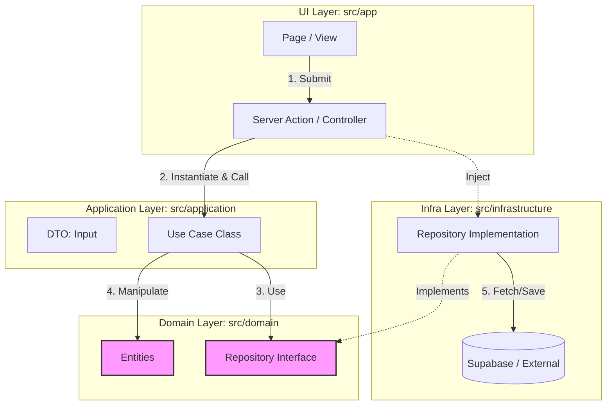

# Development Guidelines (v1.0)

## 1. Application Architecture (Clean Architecture / Onion)

開発の効率性と保守性を最大化するため、**厳格なクリーンアーキテクチャ（Onion Architecture）**を採用する。
記述量が増える「ボイラープレート」のコストよりも、**「関心事の分離」**と**「依存方向の厳守」**を最優先する。

### 1.1. Core Philosophy
*   **Use Case層の導入:** UIとロジックを完全に切り離し、実装単位（Context）を明確にする。
*   **DIP (Dependency Inversion Principle) の徹底:** `Domain` 層にインターフェースを置き、`Infrastructure` 層がそれを実装する。

### 1.2. Directory Structure

```text
src/
├── app/                      # [UI Layer] Next.js App Router (Pages, Layouts)
│   ├── _actions/             # Server Actions (Controller / Entry Point)
│   └── (routes)/             # 各画面のルーティング
├── components/               # [UI Layer] React Components (Pure View)
│
├── domain/                   # [Domain Layer] ★最重要・外部依存ゼロ
│   ├── entities/             # 型定義・データ構造 (User, Score)
│   ├── services/             # 純粋なドメインロジック (計算・判定)
│   └── repositories/         # リポジトリのインターフェース定義 (IUserRepository)
│
├── application/              # [Use Case Layer] アプリケーションの機能単位
│   ├── use-cases/            # 実処理クラス (RegisterUserUseCase)
│   └── dtos/                 # 入出力データ定義 (RegisterUserInput)
│
├── infrastructure/           # [Infra Layer] 技術的詳細・外部連携
│   ├── database/             # Supabase Client, Prismaなど
│   ├── repositories/         # Domain層IFの実装 (SupabaseUserRepository)
│   └── external/             # 外部APIクライアント (Stripe, Geminiなど)
│
└── lib/                      # [Shared] 汎用ユーティリティ
```

### 1.3. Layers Definition & Responsibilities

#### Domain Layer (`src/domain/`)
*   **役割:** ビジネスの「用語」「ルール」「契約（インターフェース）」を定義する。
*   **ルール:** 他のいかなる層（Application, Infra, UI）にも依存してはならない。
*   **実装のポイント:** 「まずは技術詳細を無視して、TypeScriptの型とInterfaceだけ定義する」

#### Application Layer (`src/application/`)
*   **役割:** ユーザーが「何をしたいか（ユースケース）」を表現する。
*   **構成:**
    *   **Use Case:** ドメイン層のInterfaceを使って処理フローを記述する。具体的なDB操作は知らなくて良い。
    *   **DTO:** UI層とやり取りするための単純なデータ型。
*   **実装のポイント:** 「Repository Interfaceを使って、〇〇を行うビジネスロジックを実装する」
    *   **Validation Rule:** DTOの定義には必ず **Zod Schema** を併記し、型定義は `z.infer` から生成する。
        ```ts
        // src/application/dtos/user.dto.ts
        import { z } from 'zod';
        export const UserSchema = z.object({ name: z.string().min(1) });
        export type UserDto = z.infer<typeof UserSchema>;
        ```

#### Infrastructure Layer (`src/infrastructure/`)
*   **役割:** ドメイン層で定義されたInterfaceを、具体的な技術（Supabase, API）で実装する。
*   **ルール:** ここを変更しても、DomainやApplication層のコードを変えてはならない。
*   **実装のポイント:** 「Supabaseを使って `IUserRepository` の実体クラスを作成する」

#### UI Layer (`src/app/`, `src/components/`)
*   **役割:** データの表示とユーザー入力の受付。
*   **Server Actions:** コントローラーとして機能する。ここで「依存性の注入（DI）」を行い、Use Caseを実行する。
    *   **Validation Rule:** Actionの冒頭で必ず `Schema.safeParse()` を実行し、不正な入力はドメイン層に渡す前に弾く。

### 1.4. Architecture Diagram & Data Flow
依存の矢印 `-->` は常に **内側（Domain）** に向かう。



### 1.5. Development Workflow
以下の順序で実装を進めることで、依存関係の混乱を防ぐ。

1.  **Phase 1: Domain Definition** (`src/domain` Entity & Interface)
2.  **Phase 2: Use Case Implementation** (`src/application` Business Logic)
3.  **Phase 3: Infrastructure Implementation** (`src/infrastructure` DB/API Adapter)
4.  **Phase 4: UI Connection** (`src/app` Server Action & View)

## 2. Coding Standards
**Google TypeScript Style Guide** をベースとし、以下の独自ルールを追加適用する。

### 2.1. TypeScript & JavaScript
*   **TypeScript:** `strict: true` を必須とする。`any` 型の使用は原則禁止（`unknown` を使用し、型ガードを行う）。
*   **Immutability:** 変数は可能な限り `const` を使用し、再代入可能な `let` の使用を避ける。
*   **Functional:** `for` ループよりも `map`, `filter`, `reduce` 等の高階関数を使用する。

### 2.2. React / Next.js Best Practices
*   **Hooks Rules:**
    *   **Prefix:** Custom Hooksは `use` で始める。
    *   **Logic Separation:** 複雑なロジック（Effect, State Management）はコンポーネント内にベタ書きせず、`useYourLogic.ts` に切り出して責務を分離する（Colocation）。
*   **Component Definition:**
    *   `function` キーワードを使用する（アロー関数 `const Component = () => {}` は、Propsの型定義が見づらくなるため避ける）。
    *   **Props:** 必ず `interface` で定義し、エクスポートする。`React.FC` は使用しない。
    *   **Export:** 原則として **Named Export** (`export const Component = ...` または `export function ...`) を使用する。
        *   **Reason:** リファクタリング時の自動リネームを確実にするため、およびTree Shaking効率化のため。
        *   **Exception:** Next.jsの `page.tsx`, `layout.tsx` 等は `export default` が必須のため例外とする。
*   **Server vs Client:**
    *   データフェッチは Server Component で行う。
        *   **Reason:** クライアントへAPIキーやDB接続情報を露出させないため（Security）、およびJSバンドルサイズを削減するため（Performance）。VercelなどのServerless環境でも動作する。
    *   `use client` はツリーの末端（Leaf）で使用し、サーバーレンダリングの恩恵を最大化する。
    *   Image Optimization: `next/image` を使用し、レイアウトシフト（CLS）を防ぐ。
    *   **Client-Only Library Integration (The Wrapper Pattern):**
        *   **Context:** `window` / `document` に依存するライブラリ（例: `abcjs`, `leaflet`）をServer Componentから直接インポートするとビルドエラーになる。
        *   **Rule:** 以下の3ファイル構成（Wrapper Pattern）を標準とする。
            1.  `FeatureRenderer.tsx`: ライブラリを直接使用する実装（`'use client'`）。
            2.  `FeatureClientWrapper.tsx`: `dynamic(() => import('./FeatureRenderer'), { ssr: false })` を行い、ローディング中のスケルトン（`loading`）を提供する。
            3.  `index.tsx`: **Wrapperをデフォルトエクスポート** する。
            *   **Rationale:** 利用側（Server Component）は `import Feature from '@/components/features/xxx'` とするだけで、CSR限定実行とLoading UIが自動的に適用され、安全かつクリーンに保たれる。

### 2.2.1. Hydration & SSR Safety (Update from PR #3)
Next.js (App Router) における Hydration Mismatch を防ぐため、以下のルールを厳守する。

1.  **Stable IDs:**
    *   リストのキーやID属性に `Math.random()` や `Date.now()` を使用してはならない。これらはサーバーとクライアントで異なる値を生成する。
    *   **Rule:** 一意なIDが必要な場合は、必ずReact標準の `useId()` フックを使用する。

2.  **Safe State Initialization:**
    *   `window` や `localStorage` に依存する値を `useState` の初期値にしてはならない。
    *   **Bad:** `useState(() => localStorage.getItem('key'))` // Server: undefined, Client: 'value' -> Mismatch
    *   **Good:** `useState(false)` で初期化し、`useEffect` 内で値を更新する。
        ```tsx
        const [val, setVal] = useState(false);
        useEffect(() => {
            const stored = localStorage.getItem('key');
            if (stored) setVal(true);
        }, []);
        ```

3.  **Browser Extensions:**
    *   拡張機能が `html` や `body` タグに属性 (`data-uid` 等) を注入することで発生する Hydration Error は、開発環境において**無視して良い**（本番環境では影響しないため）。
    *   **Rule:** アプリケーションコードに問題がない限り、安易に `suppressHydrationWarning` を使用しない。例外的に使用する場合は、その理由をコメントに残すこと。

### 2.3. Error Handling & Logging
エラー時のログ出力はデバッグと運用監視の基盤である。**「ログ（記録）」と「エラー通知（アラート）」の役割を明確に分担し**、実行環境に応じた戦略を適用する。

#### A. Strategy Overview
| 領域 | 実行環境 | 推奨ツール | 目的・役割 |
| :--- | :--- | :--- | :--- |
| **Server** | Node.js / Edge | **Pino** (Log)<br>**Sentry** (Error) | **Pino:** システム動作の記録、監査ログ。構造化データ（JSON）必須。<br>**Sentry:** 予期せぬ例外（Crash/Exception）の検知と通知。 |
| **Client** | Browser | **Sentry** / Console | **Sentry:** ユーザー環境でのクラッシュ検知、UX計測（Vercel Speed Insights併用）。<br>**Console:** 開発時のデバッグ用。 |

#### B. Implementation Policy
*   **Server-Side:**
    *   **Architecture:** Clean Architectureに基づき、`src/domain/services/logger-interface.ts` (Interface) を定義し、`src/infrastructure/logging/pino-logger.ts` (Implementation) で実装する。
    *   **Integration:**
        *   **PinoLogger** を使用し、`ERROR` レベルのログ出力時に自動で **Sentry.captureException** が走るよう実装済み。
        *   呼び出し元（Use Case / Server Action）は Logger のみを依存し、Sentry を直接意識しない。
    *   **Traceability:**
        *   ログには可能な限り `requestId` (Trace ID) を含め、一連の処理フローを追跡可能にする。
    *   **Security (Redaction):**
        *   パスワード、トークン、メールアドレスなどの機密情報（PII）がログに残らないよう、**Pino の `redact` オプション設定を必須**とする。
    *   **Exception (CLI/Agents):**
        *   GitHub Actionsや開発用スクリプト (`agents/` 等) においては、可読性とシンプルさを優先し、`console.log` / `console.error` の使用を許可する。ただし、機密情報の出力は厳禁とする。
*   **Client-Side:**
    *   **Development:** `console.log` / `console.error` を使用してデバッグを行う。
    *   **Production:**
        *   ビルド設定 (`next.config.ts`) にて `compiler.removeConsole` を有効化する。
        *   **例外:** Sentry へのエラー通知を阻害しないよう、**`console.error` のみ削除対象から除外（exclude）する設定を必須とする**。

#### C. Log Level & Timing
*   **When to Log (ログ出力すべきタイミング):**
    *   **System Lifecycle:** アプリケーションの起動、終了、設定ロード時。
    *   **Significant Business Events:** 重要なユーザーアクション（決済、データ更新、認証成功/失敗）。これらは分析可能なよう、`event` プロパティ等を付与して識別しやすくする。
    *   **Errors & Exceptions:** 予期せぬエラー発生時（必ず Stack Trace を含める）。
    *   **Boundary Transitions:** 外部API呼び出し時（Request/Responseの概要）。※機密情報を含まないよう注意。
*   **Log Level Policy:**
    *   **ERROR:** 直ちに対処が必要な致命的エラー。システムが機能不全に陥っている状態。（Sentry通知対象）
    *   **WARN:** 予期しない事象だが、システムは継続稼働可能な状態。または非推奨機能の使用。
    *   **INFO:** 正常な動作の主要なマイルストーン。（例: アプリ起動完了、ジョブ完了、ユーザーログイン）
    *   **DEBUG:** 開発時のトラブルシューティング用詳細情報。（例: 内部変数の状態）。本番環境では原則出力しないか、出力レベル設定で制御する。

### D. Exception Handling（例外処理）

| 観点 | 推奨内容 | 目的 |
|------|----------|------|
| **統一的な例外捕捉** | すべての非同期処理（`fetch`, `axios`, `Promise` 系）と UI イベントハンドラは `try / catch` でラップし、例外は必ず捕捉する。 | 予期しないクラッシュを防ぎ、エラーログを一元化 |
| **エラーハンドラ関数の共通化** | `src/utils/errorHandler.ts` に `handleError(error: unknown, context?: string)` を実装し、`Sentry.captureException` と `console.error` を内部で呼び出す。 | 再利用性と一貫したエラーレポート |
| **ユーザー向けフィードバック** | UI では **エラートースト**（例: `react-hot-toast`）や **フォールバック UI** を表示し、内部エラー情報は決して露出しない。 | UX の低下防止と情報漏洩防止 |
| **型安全なエラー** | カスタムエラークラス `AppError extends Error { code: string; status?: number; }` を作成し、`code` でエラー種別を識別できるようにする。 | エラーの分類とハンドリングロジックの簡素化 |
| **境界層でのサニタイズ** | API 呼び出し層（`src/infrastructure/api/*`）で受け取ったエラーは **外部情報を除去** した上で上位に伝搬する。 | セキュリティ（機密情報漏洩防止） |
| **テストでの例外シナリオ** | ユニットテストは `jest.mock` で例外を強制し、`handleError` が正しく呼ばれることを検証する。 | 回帰防止と例外処理の網羅性確保 |
| **App Router での例外** | Server Components (`page.tsx`) のエラーは同ディレクトリの `error.tsx` で捕捉。Server Actions は `try/catch` し、失敗時は `{ success: false, errorMessage: '...' }` を返す。 | アプリ全体のホワイトアウト防止と安全なエラーハンドリング |
| **エラーログのレベル** | 例外は **ERROR** レベルでログ出力し、`Sentry` に必ず送信する。開発時は `console.error` でスタックトレースを確認。 | 監視とデバッグの両立 |
| **非同期 UI のローディング解除** | 例外が発生したら必ずローディング状態を解除し、ユーザーが再試行できるようにする。 | UI のハング防止 |

#### 例：クライアント側エラーハンドラ実装（`src/utils/client-error-handler.ts`）
```ts
import * as Sentry from '@sentry/nextjs';
import toast from 'react-hot-toast';

/**
 * クライアント用エラーハンドラ。Sentry へ送信し、ユーザーにはトーストで通知。
 */
export function handleClientError(error: unknown, userMessage?: string): void {
  Sentry.captureException(error);
  if (process.env.NODE_ENV === 'development') {
    console.error('[Client Error]', error);
  }
  if (userMessage) toast.error(userMessage);
}
```
```ts
// src/utils/errorHandler.ts
import * as Sentry from '@sentry/nextjs';

/**
 * アプリ全体で使用する例外ハンドラ。
 * - Sentry に例外を送信
 * - console.error でスタックトレースを出力（開発時のみ）
 * - 必要に応じて UI フィードバックをトリガー
 */
export function handleError(error: unknown, context?: string): void {
  const err = error instanceof Error ? error : new Error(String(error));

  // Sentry に例外を送信
  Sentry.captureException(err, {
    tags: { context: context ?? 'unknown' },
  });

  // 開発環境では console.error で詳細を出力
  // クライアント側は別ハンドラに委譲。サーバー側は PinoLogger を使用するのでここでは何もしない。
  if (process.env.NODE_ENV === 'development') {
    console.error('[Server Error]', err);
  }
}
```

#### 例：コンポーネントでの使用例
```tsx
import { handleError } from '@/utils/errorHandler';
import toast from 'react-hot-toast';

export default function SomeComponent() {
  const fetchData = async () => {
    try {
      const res = await fetch('/api/data');
      if (!res.ok) throw new Error('Network response was not ok');
      // …データ処理
    } catch (e) {
      handleError(e, 'SomeComponent:fetchData');
      toast.error('データ取得に失敗しました。再度お試しください。');
    }
  };

  // …
}
```

### 2.4. Documentation & Comments
*   **Documentation (JSDoc/TSDoc):**
    *   公開関数（Exported Functions）や複雑なロジックには、必ず JSDoc/TSDoc形式でコメントを記述する。
    *   IDEのホバー情報として表示されることを意識する。
*   **Language:** コメントは原則として「日本語」で記述する。
*   **What vs Why:** 「コードが何をしているか（What）」はコード自体で語る。「なぜそうしたか（Why）」や「注意点」を書く。

## 3. Deployment & CI/CD
**詳細なガイドラインは別紙参照:** [deployment-guidelines.md](./deployment-guidelines.md)
(Git Branching Strategy, CI/CD Operations, Vercel Configuration)

## 4. Styling Guidelines (Tailwind CSS)
*   **Utility First:** 原則として `className` にTailwindのユーティリティクラスを直接記述する。`@apply` は再利用性が極めて高い場合（ボタン等）に限定する。
*   **No Arbitrary Values:** `w-[350px]` のようなArbitrary Valueの使用は避け、`tailwind.config.ts` で定義されたトークン（Spacing, Colors）を使用する。デザインシステムの一貫性を保つため。
*   **Responsiveness:** **モバイルファースト**で記述する。
    *   **Rule:** プレフィックス無し＝スマホ（全サイズ）。`md:` などのプレフィックス＝そのサイズ以上での上書き（Desktop）。
    *   Example: `className="flex md:block"` → スマホでは `flex`、PCでは `block`。
*   **Class Merging (`cn` util):**
    *   再利用可能なコンポーネントでは、Props経由のスタイル上書きを可能にするため、必ず `clsx` (条件付き適用) と `tailwind-merge` (競合解決) を組み合わせたユーティリティ (`cn()` 等) を使用する。
    *   **Rule:** 文字列連結（`className + " bg-red-500"`）は禁止。`cn("bg-red-500", className)` を使用する。

## 5. Security & Database Guidelines (Supabase)
*   **RLS (Row Level Security):** すべてのテーブルに対して RLS を有効化 (`ENABLE ROW LEVEL SECURITY`) し、ポリシーを明示的に定義する。
*   **No Raw SQL:** SQLインジェクションを防ぐため、Supabase Client SDK (`supabase-js`) のメソッドチェーンのみを使用する。生SQLの実行は禁止。
*   **Secrets:** APIキーや接続文字列は `.env.local` で管理し、リポジトリにはコミットしない。クライアント側に露出させる変数は `NEXT_PUBLIC_` プレフィックスを付けるが、最小限に留める。

