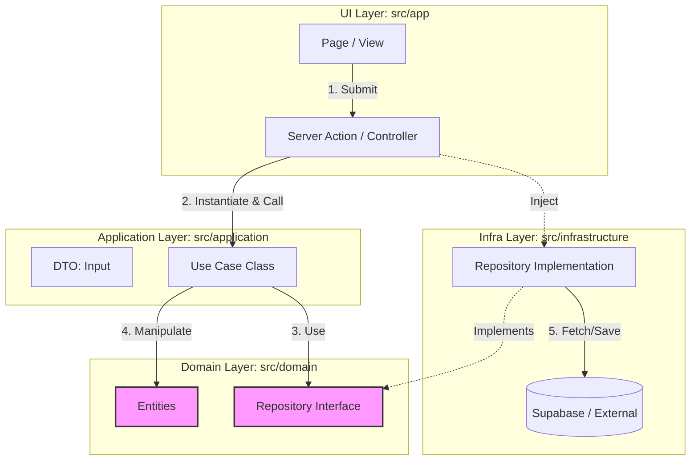

# Development Guidelines (v1.0)

## 1. Application Architecture (Clean Architecture / Onion)

開発の効率性と保守性を最大化するため、**厳格なクリーンアーキテクチャ（Onion Architecture）**を採用する。
記述量が増える「ボイラープレート」のコストよりも、**「関心事の分離」**と**「依存方向の厳守」**を最優先する。

### 1.1. Core Philosophy
*   **Use Case層の導入:** UIとロジックを完全に切り離し、実装単位（Context）を明確にする。
*   **DIP (Dependency Inversion Principle) の徹底:** `Domain` 層にインターフェースを置き、`Infrastructure` 層がそれを実装する。

### 1.2. Directory Structure

```text
src/
├── app/                      # [UI Layer] Next.js App Router (Pages, Layouts)
│   ├── _actions/             # Server Actions (Controller / Entry Point)
│   └── (routes)/             # 各画面のルーティング
├── components/               # [UI Layer] React Components (Pure View)
│
├── domain/                   # [Domain Layer] ★最重要・外部依存ゼロ
│   ├── entities/             # 型定義・データ構造 (User, Score)
│   ├── services/             # 純粋なドメインロジック (計算・判定)
│   └── repositories/         # リポジトリのインターフェース定義 (IUserRepository)
│
├── application/              # [Use Case Layer] アプリケーションの機能単位
│   ├── use-cases/            # 実処理クラス (RegisterUserUseCase)
│   └── dtos/                 # 入出力データ定義 (RegisterUserInput)
│
├── infrastructure/           # [Infra Layer] 技術的詳細・外部連携
│   ├── database/             # Supabase Client, Prismaなど
│   ├── repositories/         # Domain層IFの実装 (SupabaseUserRepository)
│   └── external/             # 外部APIクライアント (Stripe, Geminiなど)
│
└── lib/                      # [Shared] 汎用ユーティリティ
```

### 1.3. Layers Definition & Responsibilities

#### Domain Layer (`src/domain/`)
*   **役割:** ビジネスの「用語」「ルール」「契約（インターフェース）」を定義する。
*   **ルール:** 他のいかなる層（Application, Infra, UI）にも依存してはならない。
*   **実装のポイント:** 「まずは技術詳細を無視して、TypeScriptの型とInterfaceだけ定義する」

#### Application Layer (`src/application/`)
*   **役割:** ユーザーが「何をしたいか（ユースケース）」を表現する。
*   **構成:**
    *   **Use Case:** ドメイン層のInterfaceを使って処理フローを記述する。具体的なDB操作は知らなくて良い。
    *   **DTO:** UI層とやり取りするための単純なデータ型。
*   **実装のポイント:** 「Repository Interfaceを使って、〇〇を行うビジネスロジックを実装する」

#### Infrastructure Layer (`src/infrastructure/`)
*   **役割:** ドメイン層で定義されたInterfaceを、具体的な技術（Supabase, API）で実装する。
*   **ルール:** ここを変更しても、DomainやApplication層のコードを変えてはならない。
*   **実装のポイント:** 「Supabaseを使って `IUserRepository` の実体クラスを作成する」

#### UI Layer (`src/app/`, `src/components/`)
*   **役割:** データの表示とユーザー入力の受付。
*   **Server Actions:** コントローラーとして機能する。ここで「依存性の注入（DI）」を行い、Use Caseを実行する。

### 1.4. Architecture Diagram & Data Flow
依存の矢印 `-->` は常に **内側（Domain）** に向かう。



### 1.5. Development Workflow
以下の順序で実装を進めることで、依存関係の混乱を防ぐ。

1.  **Phase 1: Domain Definition** (`src/domain` Entity & Interface)
2.  **Phase 2: Use Case Implementation** (`src/application` Business Logic)
3.  **Phase 3: Infrastructure Implementation** (`src/infrastructure` DB/API Adapter)
4.  **Phase 4: UI Connection** (`src/app` Server Action & View)

## 2. Coding Standards
**Google TypeScript Style Guide** をベースとし、以下の独自ルールを追加適用する。

### 2.1. TypeScript & JavaScript
*   **TypeScript:** `strict: true` を必須とする。`any` 型の使用は原則禁止（`unknown` を使用し、型ガードを行う）。
*   **Immutability:** 変数は可能な限り `const` を使用し、再代入可能な `let` の使用を避ける。
*   **Functional:** `for` ループよりも `map`, `filter`, `reduce` 等の高階関数を使用する。

### 2.2. React / Next.js Best Practices
*   **Hooks Rules:**
    *   **Prefix:** Custom Hooksは `use` で始める。
    *   **Logic Separation:** 複雑なロジック（Effect, State Management）はコンポーネント内にベタ書きせず、`useYourLogic.ts` に切り出して責務を分離する（Colocation）。
*   **Component Definition:**
    *   `function` キーワードを使用する（アロー関数 `const Component = () => {}` は、Propsの型定義が見づらくなるため避ける）。
    *   **Props:** 必ず `interface` で定義し、エクスポートする。`React.FC` は使用しない。
*   **Server vs Client:**
    *   データフェッチは Server Component で行う。
        *   **Reason:** クライアントへAPIキーやDB接続情報を露出させないため（Security）、およびJSバンドルサイズを削減するため（Performance）。VercelなどのServerless環境でも動作する。
    *   `use client` はツリーの末端（Leaf）で使用し、サーバーレンダリングの恩恵を最大化する。
    *   Image Optimization: `next/image` を使用し、レイアウトシフト（CLS）を防ぐ。
    *   **Dynamic Imports (`ssr: false`):**
        *   Server Component (`page.tsx`等) 内で `dynamic(() => ..., { ssr: false })` を直接定義・使用することはビルドエラーの原因となる。
        *   **Rule:** クライントサイド専用のライブラリ（`window` オブジェクトに依存するもの等）を使用する場合は、必ず **クライアントコンポーネントのラッパー (`Wrapper.tsx`)** を作成し、その中で `dynamic` インポートを行う。Server Componentからはそのラッパーを import する。

### 2.3. Error Handling & Logging
エラー時のログ出力は**デバッグと運用監視の基盤**である。実行環境に応じた戦略を適用する。

#### A. Strategy Overview
| 領域 | 実行環境 | 推奨ツール | 目的 |
| :--- | :--- | :--- | :--- |
| **Server** | Node.js / Edge | **Pino** | システム監視、エラー追跡、監査ログ。<br>構造化データ（JSON）が必須。 |
| **Client** | Browser | **Sentry / Console** | ユーザー環境でのクラッシュ検知、UX計測。<br>大量のログ送信は避ける（通信コスト）。 |

#### B. Implementation Policy
*   **Server-Side:**
    *   **Architecture:** Clean Architectureに基づき、`src/domain/services/logger-interface.ts` (Interface) を定義し、`src/infrastructure/logging/pino-logger.ts` (Implementation) で実装する。
    *   **Usage:** 原則として `ILogger` インターフェース経由、または `PinoLogger` クラスを Controller (Server Action) でインスタンス化して使用する。
    *   **No Console:** `console.log` の使用は禁止する。
*   **Client-Side:**
    *   **Development:** `console.log/error` を使用してデバッグを行う。
    *   **Production:** 将来的には **Sentry** などのエラー監視SaaSへ送信する。`console.log` はビルド時に削除（`removeConsole`）することを推奨する。

#### C. Log Level & Timing
*   **When to Log (ログ出力すべきタイミング):**
    *   **System Lifecycle:** アプリケーションの起動、終了、設定ロード時。
    *   **Significant Business Events:** 重要なユーザーアクション（決済、データ更新、認証成功/失敗）。
    *   **Errors & Exceptions:** 予期せぬエラー発生時（必ずStack Traceを含める）。
    *   **Boundary Transitions:** 外部API呼び出し時（Request/Responseの概要）。※機密情報を含まないよう注意。
*   **Log Level Policy:**
    *   **ERROR:** 直ちに対処が必要な致命的エラー。システムが機能不全に陥っている状態。（例: DB接続断、決済失敗、Unhandled Exception）
    *   **WARN:** 予期しない事象だが、システムは継続稼働可能な状態。または非推奨機能の使用。（例: 外部APIのレートリミット接近、フォールバック発動）
    *   **INFO:** 正常な動作の主要なマイルストーン。（例: アプリ起動完了、ジョブ完了、ユーザーログイン）
    *   **DEBUG:** 開発時のトラブルシューティング用詳細情報。（例: 内部変数の状態、if文の分岐判定結果）。本番環境では原則出力しない。

### 2.4. Documentation & Comments
*   **Documentation (JSDoc/TSDoc):**
    *   公開関数（Exported Functions）や複雑なロジックには、必ず JSDoc/TSDoc形式でコメントを記述する。
    *   IDEのホバー情報として表示されることを意識する。
*   **Language:** コメントは原則として「日本語」で記述する。
*   **What vs Why:** 「コードが何をしているか（What）」はコード自体で語る。「なぜそうしたか（Why）」や「注意点」を書く。

## 3. Git Branching & Workflow Strategy
**GitHub Flow** を採用し、シンプルかつ高速なリリースサイクルを維持する。

### 3.1. Branch Rules
*   `master`: **Protected Branch.** 直接コミット禁止。PRマージのみ受け付ける。常にデプロイ可能な状態（Deployable）を維持する。
*   `feat/{issue-id}-{slug}`: 機能追加。
    *   **Note:** Issue ID (`#123`) を含めることで、GitHub上でIssueとPR/Branchが自動的に紐付き、追跡性（Traceability）が向上する。
*   `fix/{issue-id}-{slug}`: バグ修正。
*   `docs/{slug}`: ドキュメント修正。

### 3.2. Pull Request (PR) Policy
*   **Template:** プロジェクト規定のPRテンプレート（`.github/pull_request_template.md`）を使用する。
    *   **Summary:** 何をしたか。
    *   **Related Issues:** 関連するIssue番号 closes #123.
    *   **Verification:** どうやって動作確認したか（スクショ、動画、コマンド）。
*   **Review:** 最低1名の承認（Approve）を必須とする。
*   **Merge Strategy:** **Squash & Merge** を原則とする。
    *   **Reason:** 開発中の試行錯誤（typo修正など）の履歴を1つのコミットにまとめ、`master` の履歴を「機能単位」でクリーンに保つため。

### 3.3. Commit Message Convention
*   **Prefix:** `naming-conventions.md` で定義されたPrefix (`feat:`, `fix:`, etc.) を必ず付与する。
*   **Language:** 日本語。
*   **Scope:** 変更範囲が明確な場合は `feat(ui):` のようにスコープを記述する。

## 4. CI/CD Operations
*   **CI:** GitHub Actionsにより、Lint, TypeCheck, Unit Test を自動実行。
*   **CD:** Vercel Integrationにより自動デプロイ。

## 5. Styling Guidelines (Tailwind CSS)
*   **Utility First:** 原則として `className` にTailwindのユーティリティクラスを直接記述する。`@apply` は再利用性が極めて高い場合（ボタン等）に限定する。
*   **No Arbitrary Values:** `w-[350px]` のようなArbitrary Valueの使用は避け、`tailwind.config.ts` で定義されたトークン（Spacing, Colors）を使用する。デザインシステムの一貫性を保つため。
*   **Responsiveness:** **モバイルファースト**で記述する。
    *   **Rule:** プレフィックス無し＝スマホ（全サイズ）。`md:` などのプレフィックス＝そのサイズ以上での上書き（Desktop）。
    *   Example: `className="flex md:block"` → スマホでは `flex`、PCでは `block`。

## 6. Security & Database Guidelines (Supabase)
*   **RLS (Row Level Security):** すべてのテーブルに対して RLS を有効化 (`ENABLE ROW LEVEL SECURITY`) し、ポリシーを明示的に定義する。
*   **No Raw SQL:** SQLインジェクションを防ぐため、Supabase Client SDK (`supabase-js`) のメソッドチェーンのみを使用する。生SQLの実行は禁止。
*   **Secrets:** APIキーや接続文字列は `.env.local` で管理し、リポジトリにはコミットしない。クライアント側に露出させる変数は `NEXT_PUBLIC_` プレフィックスを付けるが、最小限に留める。
